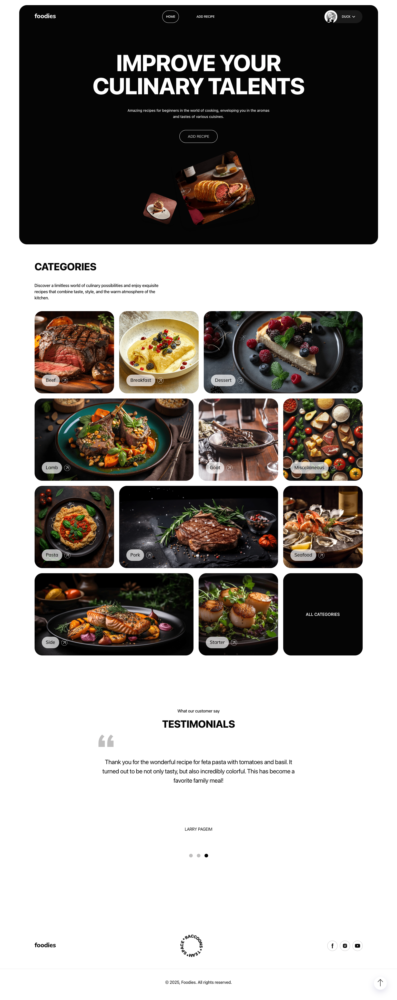
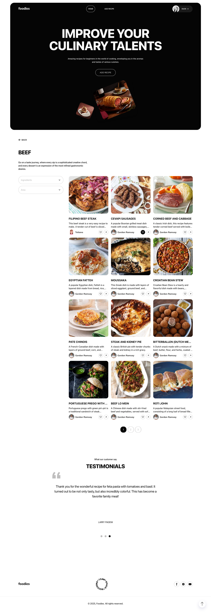
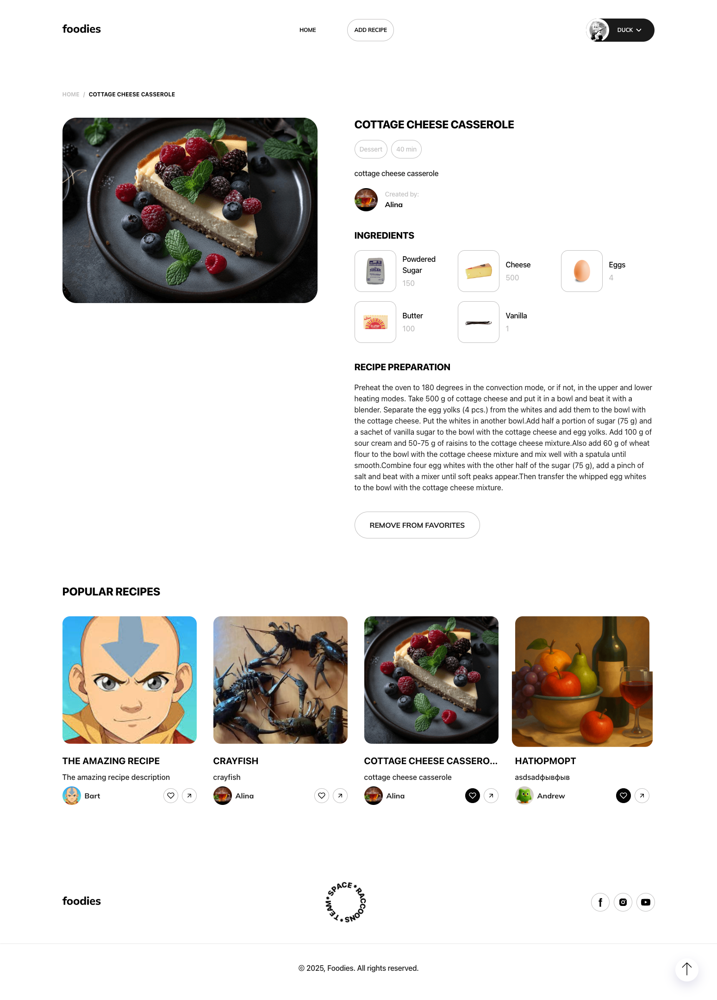
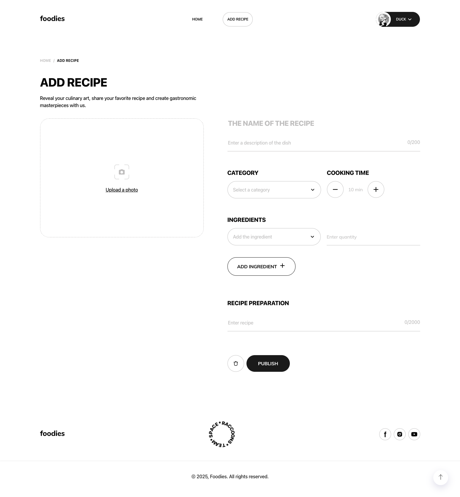
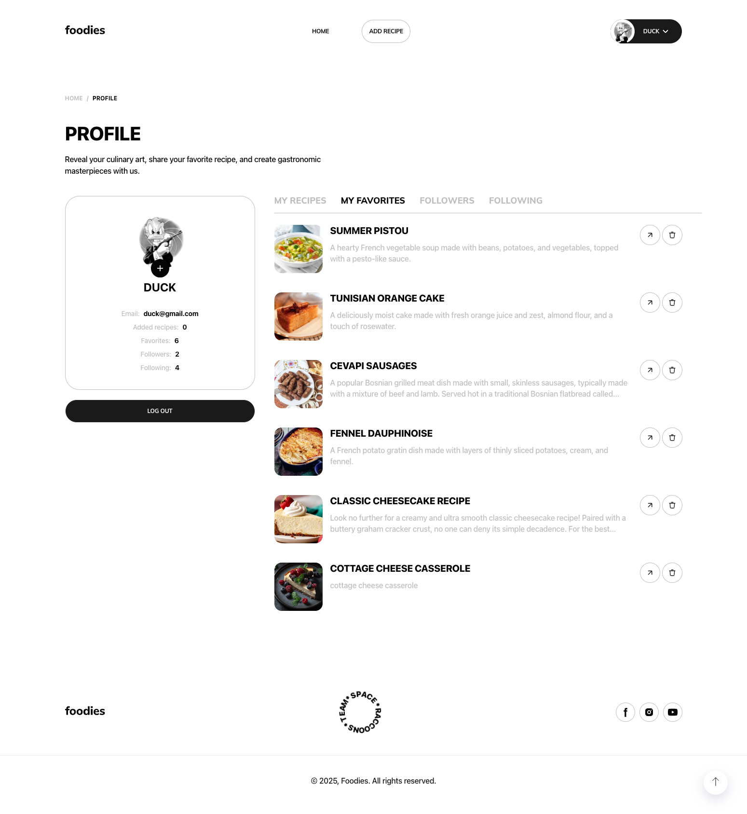
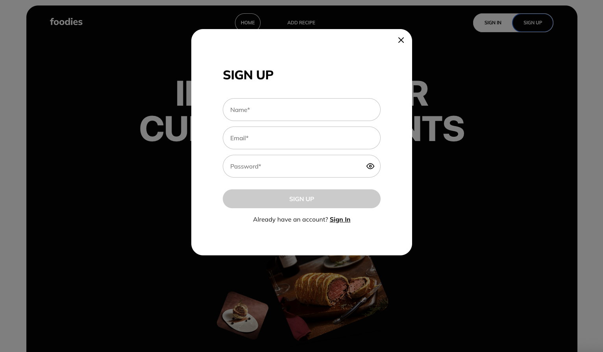
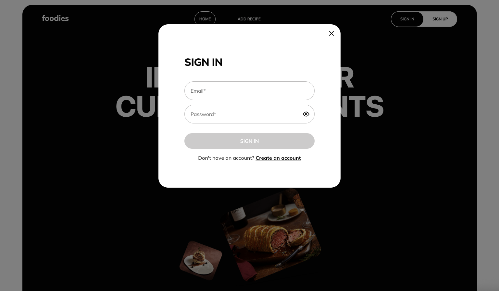
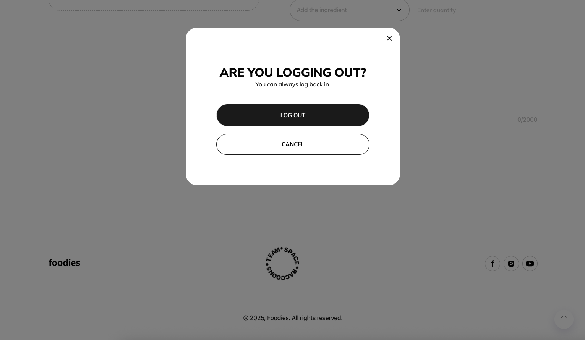
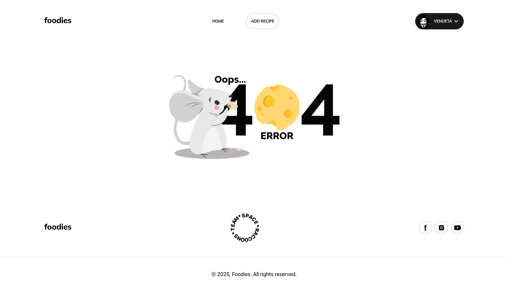

# Foodies App 🍲

**Foodies** is a full-featured platform for culinary enthusiasts, empowering
users to discover, create, save, and share delicious recipes. Whether you're a
home cook or a professional chef, Foodies brings the culinary community
together.

---

## 🌐 Project Overview

Foodies consists of two decoupled applications — a RESTful API backend and a
responsive single-page frontend — designed to deliver an intuitive and engaging
user experience.

### 🔧 Architecture

The platform is structured into two separate repositories:

- [`backend/`](./backend/README.md) – REST API server with authentication,
  PostgreSQL database, and media uploads
- [`frontend/`](./frontend/README.md) – Modern SPA with intuitive UI,
  animations, and responsive design

---

## ✨ Key Features

- 🔍 Search recipes by categories, ingredients, or regional cuisine
- 📸 Create custom recipes with step-by-step instructions and image uploads
- ⭐ Save favorites and follow other users
- 🧑‍🤝‍🧑 Engage with a cooking community
- 📱 Mobile-first responsive design for seamless experience on any device

---

## 🛠 Tech Stack

### 🧠 Backend

- **Language**: Node.js (ESM modules)
- **Framework**: Express
- **Database**: PostgreSQL + Sequelize ORM
- **Auth**: JWT-based authentication
- **Validation**: Joi
- **Image Upload**: Multer + Cloudinary
- **Email**: Nodemailer
- **Docs**: Swagger (swagger-jsdoc + swagger-ui-express)
- **Other**: bcrypt, gravatar, chalk, nanoid, dotenv, morgan, cors

### 🖼 Frontend

- **Framework**: React 19 + React DOM
- **State Management**: Redux Toolkit
- **Routing**: React Router DOM v7
- **Forms & Validation**: React Hook Form, Formik, Yup, @hookform/resolvers
- **HTTP Client**: Axios
- **Styling**: CSS Modules, Modern Normalize, clsx
- **UX/UI Enhancements**:
  - Animations: Framer Motion
  - Toasts: React Hot Toast
  - Loaders: React Spinners
  - Pagination: React Paginate
  - Scroll UX: React Scroll To Top
  - Carousels: React Slick, Swiper
- **Build Tool**: Vite
- **Linting**: ESLint, ESLint plugins for React and Hooks
- **Utilities**: Vite Plugin Remove Console

### 🧩 Infrastructure

- **Frontend Deployment**: Vercel
- **Backend Deployment**: Render
- **Media Storage**: Cloudinary
- **Version Control**: Git + GitHub

---

## 🚀 Deployment

### Backend on Render

- The repository includes a `render.yaml` file that configures the API service.
- Create a new Web Service on [Render](https://render.com) and point it to this repository.
- Environment variables should follow the examples in `backend/.env.example`.
- Render will use `npm start` to launch the service in the `backend` directory.

### Frontend on Vercel

- On [Vercel](https://vercel.com), create a new project and select this repo.
- Set `frontend` as the root directory in the project settings.
- Build command: `npm run build`
- Output directory: `dist`
- Add any environment variables needed by the frontend (e.g., API base URL).
- Each push to `main` will trigger a new deployment.

## 🚀 Getting Started

Refer to the specific README files to set up and run each part of the
application:

- [Backend Setup](./backend/README.md)
- [Frontend Setup](./frontend/README.md)

---

### Results of the completed task:

#### Page Home

#### Recipe List

#### Recipe Info

#### Add Recipe

#### Profile

#### Modal Sign Up

#### Modal Sign In

#### Modal Logging Out

#### Page 404

